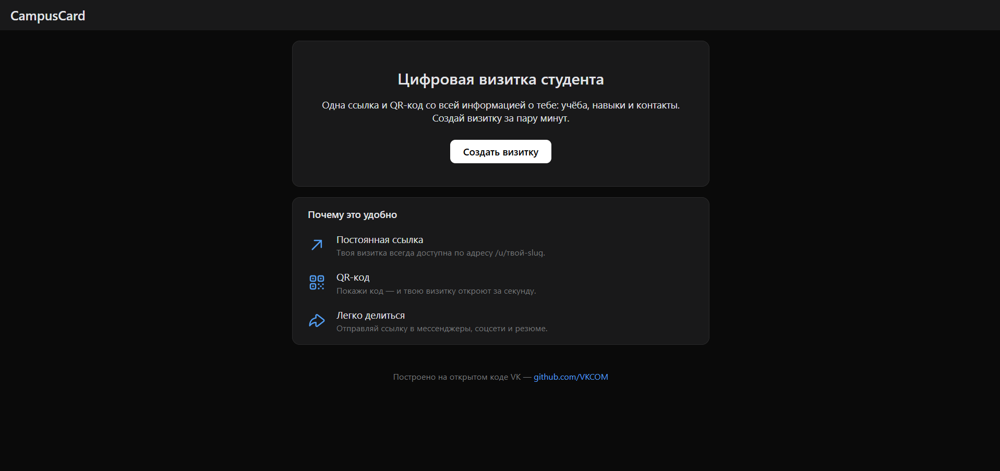
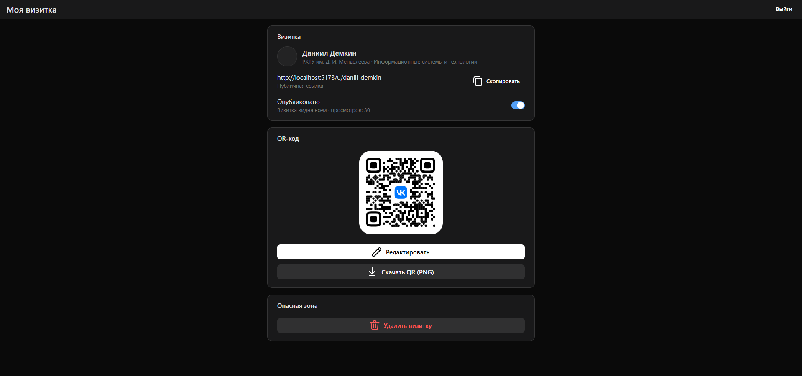
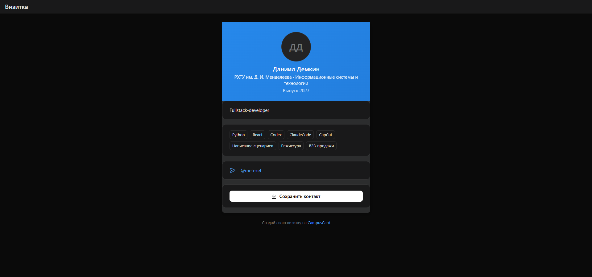

# CampusCard

[](https://github.com/metablin/campuscard/actions/workflows/ci.yml)

Сервис цифровых визиток студента: персональная страница с постоянной ссылкой
`/u/<slug>` и QR-кодом. Проект летней практики VK.





## Возможности

- Вход через VK ID (OAuth 2.1 + PKCE) и dev-логин для локальной разработки.
- Редактор визитки: темы оформления, навыки, ссылки, проверка доступности адреса.
- Публичная страница `/u/<slug>` с QR-кодом и сохранением контакта (.vcf).
- Тесты: backend — pytest, frontend — Vitest; CI на GitHub Actions;
  запуск в Docker одним compose-проектом.
- `miniapp/` — прототип VK Mini App: показывает публичную визитку через тот же API.

## Roadmap

- публикация мини-приложения в VK Mini Apps (launch-параметры, шеринг,
  деплой через vk-miniapps-deploy);
- VK ID на боевом домене;
- статистика просмотров в личном кабинете.

## Стек

- **frontend/** — React 18, TypeScript, Vite, VKUI, VK ID SDK
- **backend/** — Python 3.12, FastAPI, SQLAlchemy 2, SQLite
- **miniapp/** — прототип VK Mini App (create-vk-mini-app, VKUI, vk-bridge),
  главный экран — публичная визитка, переиспользует `PublicCardPage` и тот же
  `GET /api/u/{slug}`
- Авторизация — VK ID (OAuth 2.1 + PKCE) и dev-логин для локальной разработки
- Тесты — pytest (backend), Vitest (frontend)

## Быстрый старт (локально)

### 1. Backend
```bash
cd backend
python -m venv .venv
# Windows:  .venv\Scripts\activate
# macOS/Linux: source .venv/bin/activate
pip install -r requirements.txt
cp .env.example .env   # и заполни JWT_SECRET и пр.
uvicorn app.main:app --reload --port 8000
```
API: http://localhost:8000, документация (Swagger): http://localhost:8000/docs

### 2. Frontend (в другом терминале)
```bash
cd frontend
npm install
cp .env.example .env   # при необходимости укажи VITE_VK_APP_ID
npm run dev
```
Сайт: http://localhost:5173 (прокси `/api` → :8000)

### 3. Оба сервиса одной командой
```bash
./dev.sh   # Git Bash / macOS / Linux: backend + frontend, остановка — Ctrl+C
```

### 4. Мини-приложение (прототип)
```bash
cd miniapp
npm install
npm start            # http://localhost:5174 — прокси /api → :8000 (backend должен быть запущен)
```
Открой http://localhost:5174/?slug=anna-smirnova (после seed) или введи slug
на стартовом экране. Это заготовка для презентации: до продакшна не доводим
(roadmap: приложение в VK Mini Apps, launch-параметры вместо ?slug=, шеринг,
деплой через vk-miniapps-deploy / vk-hosting-config.json).

### Демо-данные
```bash
cd backend
python -m app.seed   # 3 опубликованные визитки: /u/anna-smirnova, /u/igor-volkov, /u/maria-kim
```

## Запуск в Docker

Один compose-проект: backend (FastAPI + SQLite в named volume `backend-data`)
и frontend (сборка Vite + статическая раздача через nginx, прокси `/api` → backend).
Проверено на Docker 29 / Compose v5 (Windows):

```bash
# переменные: скопируй образец и задай JWT_SECRET (обязателен, без него сборка не стартует)
cp .env.docker.example .env
# отредактируй .env: JWT_SECRET — случайная строка (openssl rand -hex 32)

# сборка образов (VITE_* подставляются в бандл через build args)
docker compose build

# запуск в фоне
docker compose up -d

# проверка
curl http://localhost/api/health     # {"status":"ok"} — backend через nginx-прокси
# открой http://localhost            # фронтенд (порт 80)

# демо-визитки в контейнере (идемпотентно)
docker compose exec backend python -m app.seed
# затем открой http://localhost/u/anna-smirnova

# остановка
docker compose down                  # добавь -v, чтобы удалить и volume с БД
```

Секреты — только через environment: compose подставляет значения из
переменных окружения или `.env` в корне (образец — `.env.docker.example`):
`JWT_SECRET` (обязателен, дефолта нет), `DEV_AUTH` (по умолчанию `false`,
для локального демо — `true`), `COOKIE_SECURE`, `VK_CLIENT_ID`,
`VK_CLIENT_SECRET`.
Файлы `.env` в образы не попадают (см. `.dockerignore` в backend/ и frontend/).
Например, без файла:
```bash
JWT_SECRET=$(openssl rand -hex 32) DEV_AUTH=true docker compose up --build
```

## Тесты

```bash
# backend
cd backend && pytest -q

# frontend
cd frontend && npm test
```

## CI

GitHub Actions (`.github/workflows/ci.yml`), на каждый push и pull request — два job'а:

- **backend** — Python 3.12, `pip install -r backend/requirements.txt`, `pytest -q`
  (`JWT_SECRET` задаётся тестовым значением в env, т.к. `Settings()` требует его при импорте);
- **frontend** — Node.js 20, `npm ci`, `npm run lint`, `npm test`, `npm run build`.

## Открытый код VK в проекте

| Репозиторий VKCOM | Где используется |
|---|---|
| [VKCOM/VKUI](https://github.com/VKCOM/VKUI) | весь интерфейс (React-компоненты дизайн-системы VK) |
| [VKCOM/icons](https://github.com/VKCOM/icons) | иконки контактов и действий |
| [VKCOM/vkui-tokens](https://github.com/VKCOM/vkui-tokens) | цвета тем оформления визиток |
| [VKCOM/eslint-plugin](https://github.com/VKCOM/eslint-plugin) | линтинг (наследник eslint-config) |
| VK ID + [@vkid/sdk](https://www.npmjs.com/package/@vkid/sdk) | авторизация пользователей (OAuth 2.1 + PKCE) |
| [VKCOM/vk-qr](https://github.com/VKCOM/vk-qr) | генерация QR-кода визитки (SVG с логотипом VK) |
| [VKCOM/create-vk-mini-app](https://github.com/VKCOM/create-vk-mini-app) | заготовка мини-приложения (`miniapp/`) |
| [VKCOM/vk-bridge](https://github.com/VKCOM/vk-bridge) | взаимодействие мини-приложения с клиентом VK |

## Документация

- `docs/api-contract.md` — контракт API (все эндпоинты, тела, коды ошибок)
- `docs/db-schema.md` — схема базы данных
- `docs/design-guidelines.md` — дизайн-устав (правила оформления экранов)
